class: highlight-last-item

```{r setup, include=FALSE}
knitr::opts_chunk$set(fig.retina = 2, fig.align = "center")
options(htmltools.dir.version = FALSE,scipen = 2,digits=3)
library(dplyr)
library(kableExtra)
library(epitools)
```

class: text-align-center


 <font size="20"><p style="text-align: center;">"Non-reproducible single occurrences are of no significance to science."</p> </font>

<font size="5"><p style="text-align: right;"> Popper (1959)</p></font>

---
class: highlight-last-item

### What is reproducibility?

*<p style="text-align: center;">"Reproducibility refers to the ability of a researcher to duplicate the results of a prior study using the same materials as were used by the original investigator. That is, a second researcher might use the same raw data to build the same analysis files and implement the same statistical analysis in an attempt to yield the same results. Reproducibility is a minimum necessary condition for a finding to be believable and informative."</p>*

[Report of the Subcommittee on Replicability in Science Advisory Committee to the National Science Foundation Directorate for Social, Behavioral, and Economic Sciences](https://www.nsf.gov/sbe/AC_Materials/SBE_Robust_and_Reliable_Research_Report.pdf)

The results obtained from an experiment, observational study or statistical analysis of a dataset should be repeated with a **high degree of confidence** when the study is replicated. 


---
class: highlight-last-item

### What is reproducibility?

So:

> All **results** should be documented, making all **data** and **code** available so that calculations can be run again with identical results.

<br><br>

In recent decades, there has been a growing concern that many published scientific results fail reproducibility tests, giving rise to a **REPRODUCIBILITY CRISIS**.

--


---
class: highlight-last-item

### When did the reproducibility crisis begin?

A 2016 [survey](https://www.nature.com/articles/533452a) in Nature revealed that irreproducible experiments are a problem across all domains of science:

```{r,echo=FALSE, fig.align = "center", out.width=700}
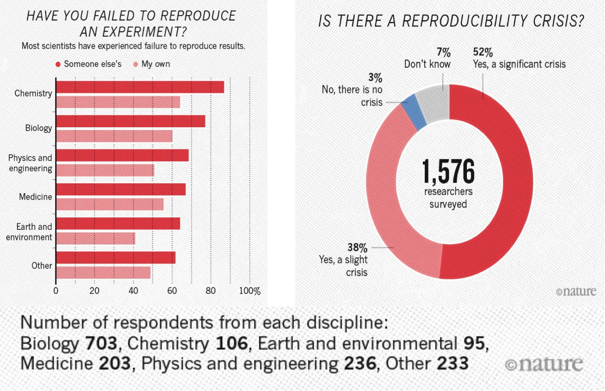
```

---
class: highlight-last-item

### When we fall into it?

- Not enough **documentation** on how experiment is conducted and data is generated

--

- **Data** used to generate original results unavailable

--

- **Software** used to generate original results unavailable

--

- Difficult to recreate software environment (libraries, versions) used to generate original results

--

- Difficult to rerun the computational step

```{r,echo=FALSE, fig.align = "center", out.width=600}
knitr::include_graphics("Images/Miracle.jpg")
```


---
class: highlight-last-item

A published article is like the top of a **pyramid**. It rests on multiple levels that each contributes to its **reproducibility**.

<br/><br/>


```{r,echo=FALSE, fig.align = "center"}
knitr::include_graphics("Images/repro-pyramid.png")
```

---

### Reproducible, replicable, robust, generalisable

While **reproducibility** is the minimum requirement and can be solved with "good enough" computational practices, **replicability/robustness/generalisability** of scientific findings are an even greater concern involving research misconduct, questionable research practices (p-hacking, HARKing, cherry-picking), sloppy methods, and other conscious and unconscious biases.

```{r,echo=FALSE, fig.align = "center", out.width=500}
knitr::include_graphics("Images/39-reproducible-replicable-robust-generalisable.jpg")
```


---
class: highlight-last-item

## The world is on the move...

```{r, echo = FALSE, out.width = 500, warning = FALSE}
library(ggplot2)
load(file = "data/google.RData")

df <- df %>% 
  dplyr::mutate(years = as.numeric(years)) %>%
  dplyr::filter(years %in% c(1999:2022)) 

ggplot(as.data.frame(table(df$years)), aes(x=Var1, y = Freq)) + geom_bar(stat="identity", fill = "#ac0033") + xlab("Years") + theme_classic() +
  scale_x_discrete(breaks = round(seq(min(df$years), max(df$years), by = 5),1)) + ggtitle("686 papers from Google scholar") + 
     theme(axis.title=element_text(size=15))


```


---
class: highlight-last-item

### How to make a reproducible research


- Share **data** (raw and pre-processed ones): The lack of data sharing is an obstacle to international research (be it academic, governmental, or commercial) for two main reasons:

    - It is generally difficult or impossible to reproduce a study without the original data.
    
--

    - The data cannot be reused or incorporated into new work by other researchers if they cannot obtain access to it.


---
class: highlight-last-item

### How to make a reproducible research


- Share **code** used for the analysis (clearly commented): code sharing enables others to be able to

--

    1. **understand** (to read and analyze) the computational parts of the work done in the article.
    
--

    1. **reproduce** (run) the computational parts of the work done in the article. 
    
--

    1. **build** on code used in the computational parts of the work done in the article, for their own work.
    
--

    1. **add** to the code used in the computational parts of the work done in the article, to improve it.
    
--

    1. **cite** the software and credit its authors when they use it.
    
--

- Write **reproducible scientific paper**


---
class: highlight-last-item

## Ingredients - share data and code

- [Datalad](https://www.datalad.org/): a free and open source distributed **data management system** that keeps track of your data, creates structure, ensures reproducibility, supports collaboration, and integrates with widely used data infrastructure.

--

- [GitHub](https://github.com/): an online software development platform used for storing, tracking, and collaborating on **software projects**. It enables developers to upload their own code files and to collaborate with fellow developers on open-source projects.

--

- [Zenodo](https://zenodo.org/): a general-purpose open repository developed under the European OpenAIRE program and operated by CERN. It allows researchers to **deposit research papers, data sets, research software, reports**, and any other research related digital artefacts. For each submission, a persistent digital object identifier (DOI) is minted, which makes the stored items easily citeable.


---
class: highlight-last-item

## Ingredients - write reproducible papers

We will use **`Rmarkdown`** because it is:

  1. **EFFICIENT**:
  
    - write text, cite sources, tidy data, analyse, table, and plot it in one programme/screen
    - re-do one, more, or all of these with ease $\rightarrow$ decrease the possibility of making mistakes in the process
    
--

  1. **FLEXIBLE**: output to various formats (e.g., `HTML`, `LaTeX`, `PDF`, `Word`)

--

  1. **OPEN ACCESS/SOURCE**:
  
    - use for free
    - create documents accessible to anyone with a computer and internet connection
    - benefit from the work of a great community of users/developers

--


---
class: highlight-last-item

## Ingredients - write reproducible papers

**`Rmarkdown`** permits to have **reproducibilty BEFORE publication**:

- Having written a complete draft with data including re-coded variables, tables, figures, and text with references to specific results (e.g., numbers from summary and/or regression statistics)
- If you and/or your co-authors decide to reverse a re-coded variable to its previous/original measure and/or, to exclude a subgroup of observations from analysis
- Draft written as completely reproducible draft which leads to easy revision of the analysis after receving some comments from journal's reviewers.

--

and **reproducibility AFTER publication**:

- After your paper is published, if others, including your future self, would like to test how robust the results are
- to reversing a re-coded variable to its previous/original measure
- and/or, to excluding a subgroup of observations from analysis


---

## Further reading on reproducibility and open science


- [The Turing way](https://the-turing-way.netlify.app/community-handbook/community-handbook.html)

--

- Good talks on open reproducible research can be found [here](https://inundata.org/talks/index.html).

--

- [Poldrack, R. A. (2019). The costs of reproducibility. Neuron, 101(1), 11-14.](https://www.sciencedirect.com/science/article/pii/S0896627318310390)

--

- [Wicherts, Jelte M., Marjan Bakker, and Dylan Molenaar. "Willingness to share research data is related to the strength of the evidence and the quality of reporting of statistical results." PloS one 6.11 (2011): e26828.](https://journals.plos.org/plosone/article?id=10.1371/journal.pone.0026828)

--

- [Wicherts, J. M., & Bakker, M. (2012). Publish (your data) or (let the data) perish! Why not publish your data too?. Intelligence, 40(2), 73-76.](https://www.sciencedirect.com/science/article/pii/S0160289612000050?casa_token=XBq3mdmEv0oAAAAA:OP_dcIp6fsBT4o24KefkuzvQxh8DKjd_jpZni97jtUu4DtufgTVVr76PIya8IZjsNi-na_dTtQ)

--

- [Baker, M. (2016). Reproducibility crisis. Nature, 533(26), 353-66.](https://www.nature.com/articles/533452a)


---

<br/><br/>
<br/><br/>
<br/><br/>

```{r, echo = FALSE}
knitr::include_graphics("Images/research_comic_phd.gif")
```


---
class: inverse, center, middle

# Let's start!!


---
class: highlight-last-item

## First steps

1. Create an **`RStudio` project**

--

1. Link the **`RStudio` project** to a **`GitHub`** repository

--

1. Create an **`Rmarkdown`** (`.rmd`) file.

```{r,echo=FALSE, fig.align = "center"}
knitr::include_graphics("https://tenor.com/view/kios-angry-computer-stare-gif-16068406.gif")
```


---
### Using `RStudio` projects

**`RStudio` projects** make it straightforward to divide your work into multiple contexts, each with their own working directory, workspace, history, and source documents.

To create a new project in the `RStudio` IDE, use the `New Project` command (available on the `Projects` (top right corner) menu or go to `File > New Project`. You will have the following window:

```{r,echo=FALSE, fig.align = "center"}
knitr::include_graphics("Images/projects_new.png")
```


---
class: highlight-last-item

### Using `RStudio` projects

When a new project is created `RStudio`:

- Creates a **project file** (with an `.Rproj` extension) within the project directory. This file contains various project options and can also be used as a shortcut for opening the project directly from the filesystem.

--

- Creates a **hidden directory** (named `.Rproj.user`) where project-specific temporary files (e.g. auto-saved source documents, window-state, etc.) are stored. This directory is also automatically added to `.Rbuildignore`, `.gitignore`, etc. if required.

--

- **Loads the project** into `RStudio` and display its name in the `Projects` toolbar (which is located on the far right side of the main toolbar).


---
class: highlight-last-item

### Using `RStudio` projects

There are several ways to **open a project**:

- Using the `Open Project` command (available from both the `File` menu and the `Projects` toolbar) to browse for and select an existing project file (e.g. `MyProject.Rproj`).

--

- Selecting a project from the list of most recently opened projects (also available from both the `File` menu and the `Projects` toolbar).

--

- Double-clicking on the project file within the system shell (e.g. Windows Explorer, OSX Finder, etc.).


---
class: highlight-last-item

### Using `RStudio` projects

When a project is opened within `RStudio` the following actions are taken:

- A new `R` session (process) is started

--

- The `.Rprofile` file (user-controllable files to set options and environment variables) in the project's main directory (if any) is sourced by `R`

--

- The `.RData` file (where the objects are stored) in the project's main directory is loaded (if project options indicate that it should be loaded).

--

- The `.Rhistory` file (a history of code executed, not written) in the project's main directory is loaded into the `RStudio History` window.

--

- The current working directory is set to the **project directory**.

--

- Previously edited source documents are restored into editor tabs

--

- Other `RStudio` settings (e.g. active tabs, splitter positions, etc.) are restored to where they were the last time the project was closed.


---
### `GitHub`

Open `GitHub Desktop` and go to `Add > Create new repository`
  
```{r, echo = FALSE, out.width = 400}
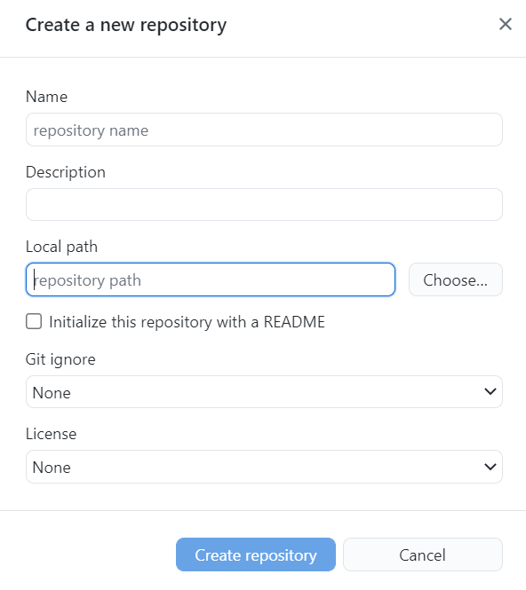
```

---
class: highlight-last-item

### `GitHub`

- **Name**: here you must put the repository name (same name used for the `RStudio` project);

--

- **Description**: here you can put a description of the project;

--

- **Local path**: here you must put the path where the `RStudio` project is. There is also the option `Choose..` for navigating directly into your computer;

--

- **Inizialize the repository with a README**: flag it! Here you must describe what the repository contains.

<br><br>

then click on `Create repository`!


---
### `GitHub`

and `Publish repository`!

```{r, echo = FALSE, out.width = 1000}
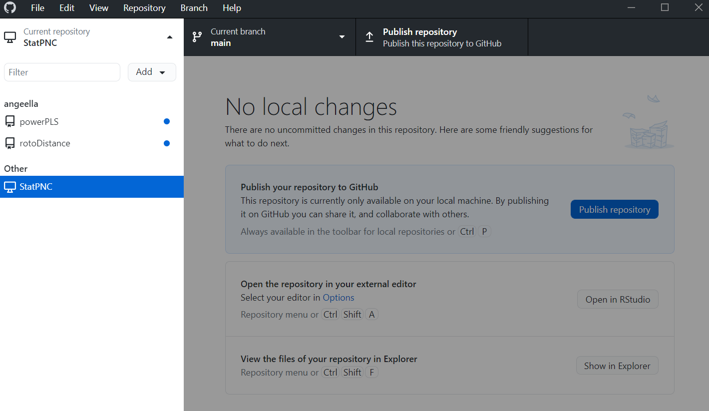
```

---
### `GitHub`

> **Every time that you make a change on your `RStudio` projects, you can push these changes in the `GitHub` repositories**

```{r, echo = FALSE, out.width = 1000}
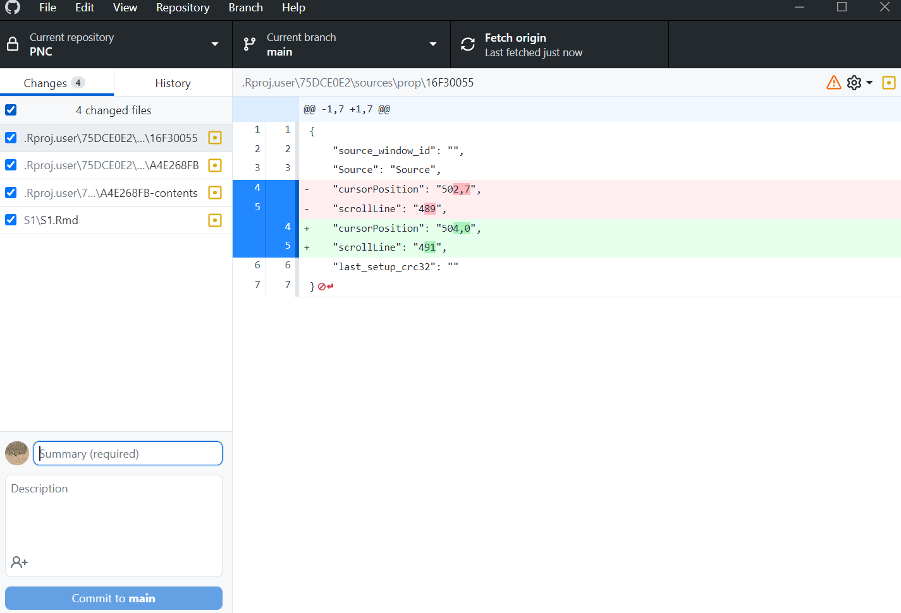
```

---
class: highlight-last-item

### `GitHub`

- **PUSH**: Changes in the local repository go to the `GitHub` repository

--

- **PULL**: Changes in the `GitHub` repository go to the local repository

Here, I presented the *easiest* way to manage `GitHub` with `RStudio`. However, `RStudio` has the possibility to manage `GitHub` directly using `Git`. For more details:

- [https://rfortherestofus.com/2021/02/how-to-use-git-github-with-r/](https://rfortherestofus.com/2021/02/how-to-use-git-github-with-r/)

- [https://annakrystalli.me/talks/r-in-repro-research.html#27](https://annakrystalli.me/talks/r-in-repro-research.html#27)

<br><br>

So, everything is ready for creating our amazing `Rmarkdown` project!


---

### Before `Rmarkdown`...

Let see how `RStudio` is constructed:

--

```{r, echo = FALSE}
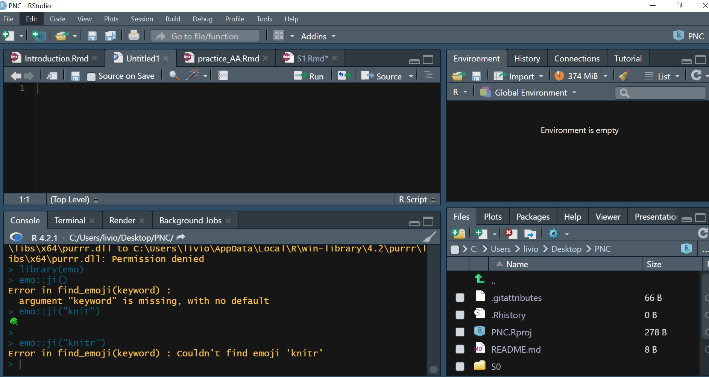
```

---

### `Rmarkdown` document

To use R `Markdown`, you have to install `R` and the `R` package `rmarkdown`. I will talk about packages later. Simply write on `RStudio` console (bottom-left window):

```{r, eval = FALSE}
install.packages("rmarkdown")
```

--

`Rmarkdown` (`.Rmd)` integrates:

- a **documentantion** language (`.md`),

- a **programming** language (`R`),

- functionality to "knit" them together through `r emo::ji("knit")` `knitr`.

--

**Features**:

- provides a framework for writing narratives around code and data,

- code re-run in a clean environment every time the document is "knit" `r emo::ji("knit")`.

---

### `Rmarkdown` document

Clicking on `File > New File > RMarkdown... > Document` you will create the following `RMarkdown` file:

--

```{r, echo = FALSE, out.width = 1000}
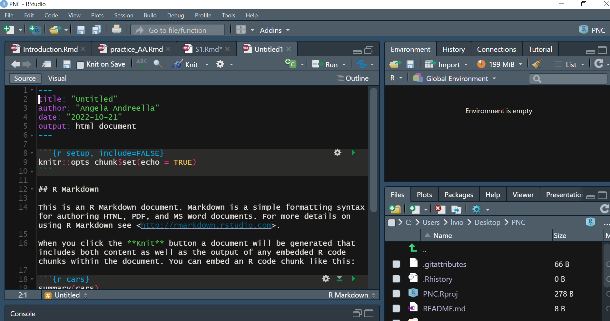
```

---

### `Rmarkdown` document

Clicking on `r emo::ji("knit")` `Knit` you will create the following `html` file:

--

```{r, echo = FALSE, out.width = 1000}
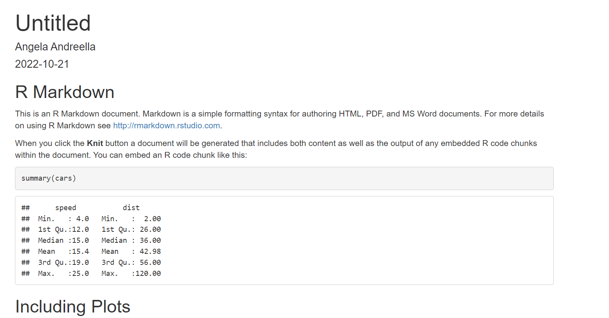
```

---
class: highlight-last-item


### Ingredients of `Rmarkdown` document

The `Rmarkdown` document has three components:

1. **YAML**: for setting metadata

--

1. **Text**: your text

--

1. **Code chunks**: your `R` script

--

```{r, echo = FALSE, out.width = 1000}
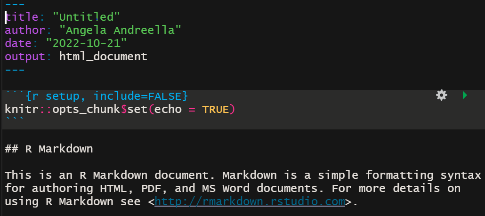
```


---
class: highlight-last-item


### Ingredients of `Rmarkdown` document - YAML

- `.Rmd` documents start with YAML which  includes the metadata variables e.g., title, output format. It is written between a pair of three hyphens -

--

- Documents as output formats include HTML, LaTeX, PDF, Word, e.g.,

```{r, eval = FALSE}
title: "Untitled"
author: "Angela Andreella"
date: "2022-10-21"
output: word_document
```

other are: `html_document`, `pdf_document`, `latex_document`, `odt_document`, `github_document`, `md_document`, `rtf_document`, `powerpoint_presentation`, `beamer_presentation`, `iosslides_presentation`, `slidy_presentation`.


---
class: highlight-last-item


### Ingredients of `Rmarkdown` document - YAML

You can also specify:

- `bibliography` as `.bib` file (it must be in the same folder of the `.Rmd` file) or specify the full path where the `.bib` file is.

```{r, eval = FALSE}
title: "Untitled"
author: "Angela Andreella"
date: "2022-10-21"
output: word_document
bibliography: references.bib
```

There are many other options, see [here](https://bookdown.org/yihui/rmarkdown-cookbook)

---
class: highlight-last-item

### Ingredients of `Rmarkdown` document - Text

- **Multiple spaces** on a given line are reduced to **one**;

--

- Line endings with **fewer than two spaces** are **ignored**;

--

- Two or more spaces at the end of lines introduce **hard breaks**, forcing a new line;

--

- Spaces on lines that start with a vertical line `|` are **kept**;

--

- Lines starting with the greater-than sign `>` introduce **block quotes**;

--

- **One or more blank** lines introduce a **new paragraph**,

--

- Text with the syntax `<!- - comments - - >` is **omitted** from output


---
class: highlight-last-item

### Ingredients of `Rmarkdown` document - Text

- The sign `#` introduces **headers**; lower levels are created with additional signs - up to total five levels:

  - `# Introduction` becomes 
  # Introduction

  - `## Introduction` becomes 
  ## Introduction

  
  - etc
  
---
class: highlight-last-item

### Ingredients of `Rmarkdown` document - Text

- `*italics*` becomes *italics*

--

- `*bold*` becomes *bold*

--

- `**_bolditalics_**` becomes **_bolditalics_**

--

- `~~strikethrough~~` becomes ~~strikethrough~~

--

- `[see this website](https://www.youtube.com/watch?v=FpCrY7x5nEE)` becomes [see this website](https://www.youtube.com/watch?v=FpCrY7x5nEE)

--

- `[email me](mailto:angela.andreella@unive.it)` becomes [email me](mailto:angela.andreella@unive.it)


---
class: highlight-last-item

### Ingredients of `Rmarkdown` document - Text

- Inline equations go between a pair of single dollar signs `$` - with no space between the signs and the equation itself:

    `$E = mc^{2}$` becomes $E = mc^{2}$

- Block equations go in between a pair of double dollar signs - with or without spaces, it works:

```{r, eval = FALSE}
$$E = mc^{2}$$
```

becomes $$E = mc^{2}$$

---
class: highlight-last-item

### Ingredients of `Rmarkdown` document - Text

Lines starting with asterisk $*$ as well as plus $+$ or minus $-$ signs introduce **lists**:

```{r, eval = FALSE}
- books
- articles
- reports
```

- books
- articles
- reports


---

### Ingredients of `Rmarkdown` document - Text

Lists can be **nested** within each other, with indentation:


```{r, eval = FALSE}
+ books
+ articles
    - published
    - under review
        + revised and resubmitted
    - work in progress
```

+ books
+ articles
    - published
    - under review
        + revised and resubmitted
    - work in progress
    
---

### Ingredients of `Rmarkdown` document - Text   

List items can be **numbered**:

```{r, eval = FALSE}
1. books
2. articles
    - published
    - under review
        + revised and resubmitted
    - work in progress
```

1. books
2. articles
    - published
    - under review
        + revised and resubmitted
    - work in progress
    
---

### Ingredients of `Rmarkdown` document - Managing References

**References** are defined in `.bib` files, they follow the `BibTeX` format `r emo::ji("book")`.

You can take the reference in the `BibTeX` format directly from google scholar:

```{r, echo = FALSE}
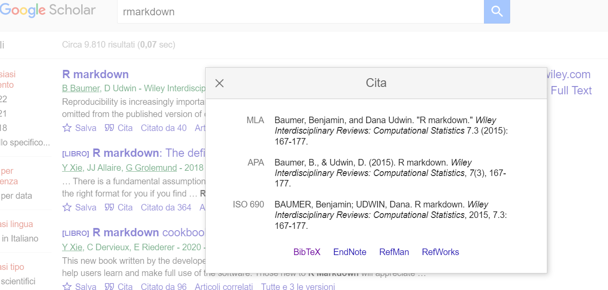
```

---

### Ingredients of `Rmarkdown` document - Managing References

All citations keys take the 'at' sign `@` while square brackets and/or minus signs introduce variation

```{r, echo = FALSE}
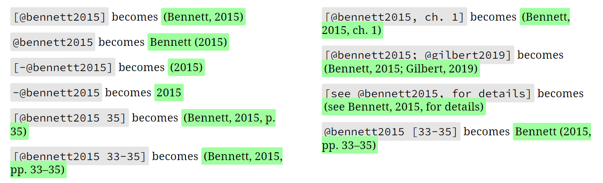
```

The list of references appears **after the last line of the output document, with no section header**. So that you can choose the header yourself, by ending ``.Rmd` documents with a header of your choice

---
class: highlight-last-item

### Ingredients of `Rmarkdown` document - Code

Most codes go inside **code chunks**, delimited between a pair of **three backticks** 

```{r, echo = FALSE}
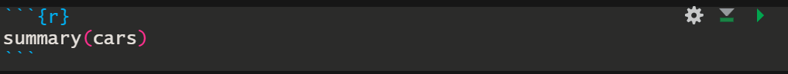
```

Codes can also go in line with text using 

```{r, echo = FALSE}
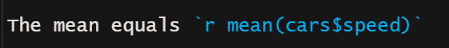
```

On the same line with the first delimiter, and in curly brackets `{`, code chunks take

- a **language** engine, e.g., `R`, `Python`..

--

- a **label** after the comma (recommended but optional), It can be helpful for navigating through error messages). Duplicate labels lead to errors during compilation

--

- one or more options, e.g., `include`, `echo`, `out.width`,..

 


---
class: highlight-last-item

### Ingredients of `Rmarkdown` document - Code

Some of the most used **options**:

- `include = FALSE`: do not include the output

--

- `echo = FALSE`: do not print the code

--

- `warning = FALSE`: exclude the warning message

--

- `comment = FALSE`: exclude the comments 

--

- `eval = FALSE`: do not run the code

--

- `out.height = 50%`, `out.width = 50%`: define the size of figures as they appear in the output document

--

- `fig.align="center"`: Define the alignment of figures - `left`, `right`, or `center`

--

- `fig.caption="my caption`: Define the caption for figures

The complete list of options is available at [https://yihui.org/knitr/options](https://yihui.org/knitr/options).


---
class: highlight-last-item

### Ingredients of `Rmarkdown` document - Code

It is recommended to use the **first code chunk** for general setup, where you can:

- define your own **defaults** for chunk options, with `knitr::opts_chunk$set()`

--

- load the necessary **packages**

--

- import **raw data**


---
class: highlight-last-item

### Ingredients of `Rmarkdown` document - Figure and tables

There are many ways to include a **figure** in a `Rmarkdown` document:

- `` in the text.

--

- `knitr::include_graphics("Images/figure.extension")` in a code chuck.

--

- directly using `R` functions in a code chuck.

as well as for the **tables**, the easy way is to use

```{r, eval = FALSE}
knitr::kable(table)
```

that permits to specify the `format` argument, e.g., `knitr::kable(table, format = "latex)`.


---
class: highlight-last-item

### Ingredients of `Rmarkdown` document - Cross-references

If the output is `PDF`:

Insert a LaTeX label in the caption:

- `\label{table_caption}` for tables

--

- `\\label{figure_caption}` for figures


and then use the `\autoref{table_caption}`/`\autoref{figure_caption}` syntax in text.

---
class: highlight-last-item

### Ingredients of `Rmarkdown` document - Cross-references

If you want a `HTML` or `Word` output (this way also works for the `PDF` ones):

1. In the `YAML` you must specify as `output`:

  - `bookdown::word_document2:` for `word` output,
  - `bookdown::html_document2:` for `word` output,
  - `bookdown::pdf_document2:` for `PDF` output.
  
2. The label of the figure is the name of the chuck.

3. Use `\@ref(tab:name-of-the-chuck)` to cite the table and `\@ref(fig:name-of-the-chuck)` to cite the figure.


---
class: highlight-last-item

### If you do not know or do not remember how to do something...

- [**Stackoverflow!!**](https://stackoverflow.com/)

--

- Xie, Y., J. Allaire, and G. Grolemund (2018). R Markdown: The Definitive Guide. ISBN 9781138359338. Boca Raton, Florida: Chapman and Hall/CRC. <https://bookdown.org/yihui/rmarkdown.

--

- [Rmarkdown cheat sheet](https://public.deq.virginia.gov/WPS/R/rmarkdown-2.0.pdf) 


